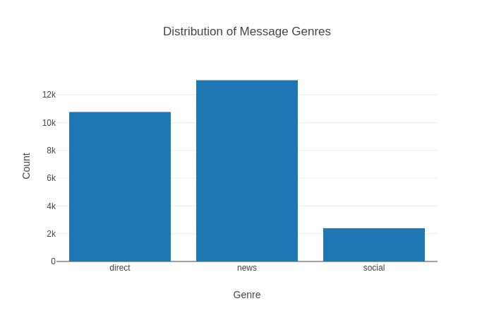
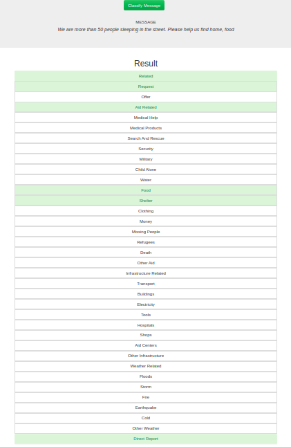
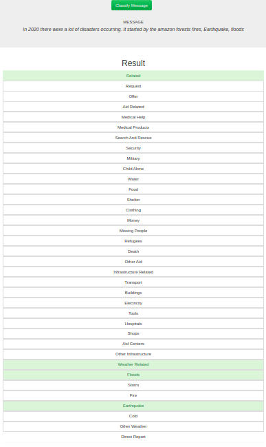

# Disaster Response Pipeline Project

### Project Motivation

In **Data Engineering** section In the **Data Science NanoDegree**,I have learned and built my data engineering skills to expand your opportunities and potential as a data scientist. In this project, I applied these skills to analyze disaster data from Figure Eight to build a model for an API that classifies disaster messages.

In the Project Workspace, I Found a data set containing real messages that were sent during disaster events. I created a machine learning pipeline to categorize these events so that you can send the messages to an appropriate disaster relief agency.

The project will include a web app where an emergency worker can input a new message and get classification results in several categories. The web app will also display visualizations of the data. This project will show off your software skills, including your ability to create basic data pipelines and write clean, organized code!

Below is a screenshots of the web app.

### Project Details

-Project Workspace - ETL
The first part of your data pipeline is the Extract, Transform, and Load process. Here, you will read the dataset, clean the data, and then store it in a SQLite database. We expect you to do the data cleaning with pandas. To load the data into an SQLite database, you can use the pandas dataframe .to_sql() method, which you can use with an SQLAlchemy engine.

Some exploratory data analysis are done in order to figure out how you want to clean the data set.

-Project Workspace - Machine Learning Pipeline
For the machine learning portion, you will split the data into a training set and a test set. Then, you will create a machine learning pipeline that uses NLTK, as well as scikit-learn's Pipeline and GridSearchCV to output a final model that uses the message column to predict classifications for 36 categories (multi-output classification). Finally, export the model to a pickle file. After completing the notebook, include the final machine learning code in train_classifier.py.

-Data Pipelines: Python Scripts
After completing the notebooks for the ETL and machine learning pipeline, you'll need to transfer your work into Python scripts, process_data.py and train_classifier.py. If someone in the future comes with a revised or new dataset of messages, they should be able to easily create a new model just by running your code. These Python scripts should be able to run with additional arguments specifying the files used for the data and model.

### Instructions:
1. Run the following commands in the project's root directory to set up your database and model.

    - To run ETL pipeline that cleans data and stores in database
        `python data/process_data.py data/disaster_messages.csv data/disaster_categories.csv data/DisasterResponse.db`
    - To run ML pipeline that trains classifier and saves
        `python models/train_classifier.py data/DisasterResponse.db models/classifier.pkl`

2. Run the following command in the app's directory to run your web app.
    `python run.py`

3. Go to http://0.0.0.0:3001/. However this did not work and I made the following steps as provided by udacity 

**Udacity workspace**
- Run your app with python run.py command
- Open another terminal and type env|grep WORK this will give you the spaceid (it will start with view*** and some characters after that)
- Now open your browser window and type https://viewa7a4999b-3001.udacity-student-workspaces.com, replace the whole viewa7a4999b with your space id that you got in the step 2
- Press enter 

**Local Machine**
- Once your app is running (python run.py)
- Go to http://localhost:3001 and the app will now run

### Result examples
The first sentence **(We are more than 50 people sleeping in the street. Please help us find home,food)**

The second sentence **(In 2020 there were a lot of disasters occurring. It started by the amazon forests fires, Earthquake, floods)**

